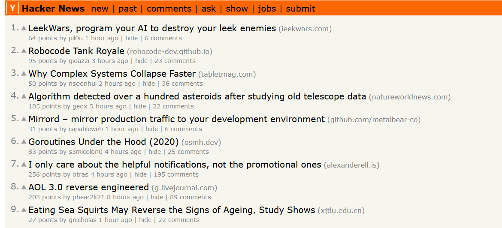
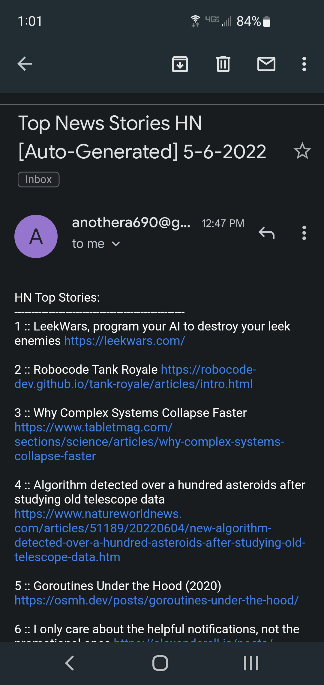

# Python Web Scraper & Email Generator
 
This project scrapes the front page of hacker news using python and sends an email of the titles to a users email address.

<table><tr>
<td>  </td>
<td>  </td>
</tr></table>

## Usage
This project depends on creating a google cloud project in order to enable the gmail API and get Oauth client and secret keys. For more details on that process, read this [stackoverflow post.](https://stackoverflow.com/a/72346413/9991592)

To change the email addresse receiving the content list, change the global variable `SENDTO`.

To change the email address sending the content list, add another email address to the test user section in the google cloud project and change the global variable `SENDFROM`.

## Dependencies
- [Beautiful Soup 4](https://beautiful-soup-4.readthedocs.io/en/latest/)
- [Requests](https://requests.readthedocs.io/en/latest/)
- [Yagmail](https://yagmail.readthedocs.io/en/latest/)
see requirements.txt for full list

## Roadmap/Extensions
- Error handling
- Allow users to specify site to be scanned 
- Allow users to specify which tags and elements to fetch
- GUI interface